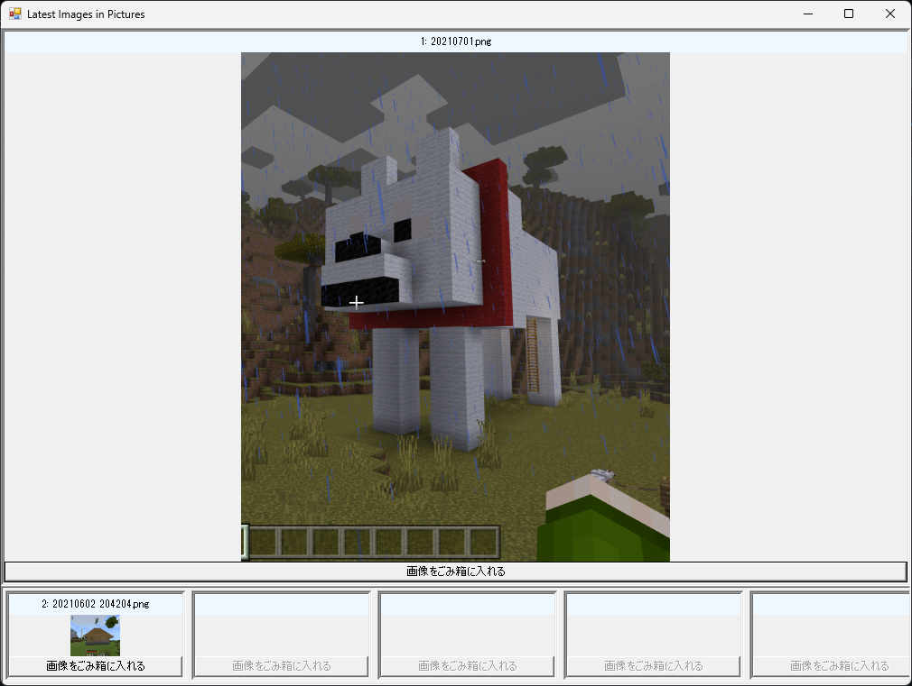

# PSLatestPictureViewer

ピクチャ内の最新の画像を表示する。

## 機能

- 最も最近に更新された画像が不要なら、削除できる。
- それ以外の最近、更新された画像を画面下部に小さく表示する。

## 要件

- Windows 10+
- PowerShell 5.1+

## デモ



## 利用方法

```powershell
git clone https://github.com/kumarstack55/PSLatestPictureViewer.git
Set-Location .\PSLatestPictureViewer\
.\Invoke-App.ps1
```

## TODO

- Pictures 以外のフォルダを指定できるようにする。

## LICENSE

MIT